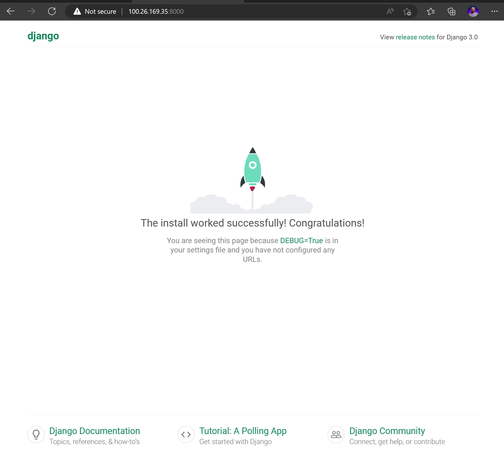

# Ansible Day1

-   You have to create AWS EC2s and use your key file for ssh those machines and allow port 22, port 80 and 8090 and 8000, Replace ansible_host variable in inventory files with your EC2s public IPs 

## Task 1

-  create 2 machines, Install apache2, Change ports to 8090 and Creaete custom index page
    -   cd Task1 folder
        ```bash
        cd Task1
        ```
    -   run command
        ```bash
        ansible-playbook playbook.yaml -i inventory.ini
        ```
    -   

<br/>

## Task 2

-  Deploy Django project
    -   cd Task2 folder
        ```bash
        cd Task2
        ```
    -   run command
        ```bash
        ansible-playbook playbook.yaml -i inventory.ini
        ```
    -   

